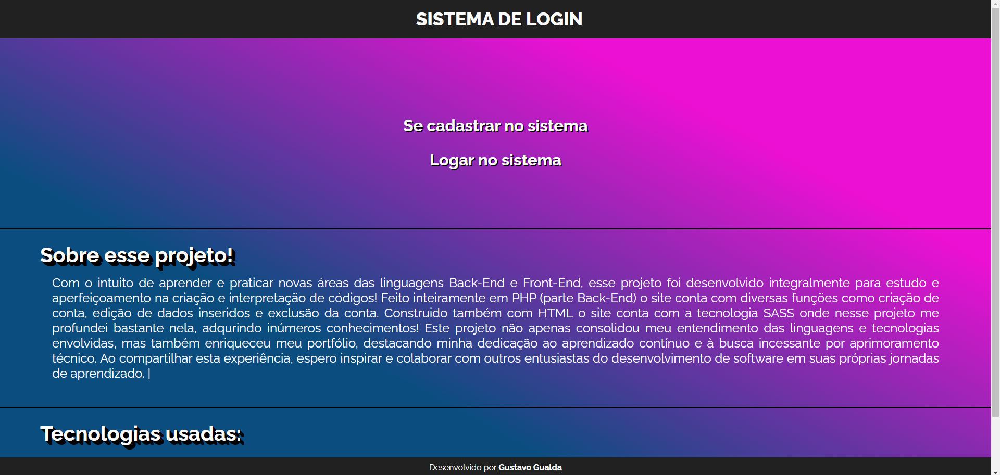

# Sistema de Login

## Descrição do Projeto

Este é um projeto de sistema de login que oferece funcionalidades básicas, como criação de conta, login, logout, exclusão de conta e alteração de informações de perfil.  

<a href="https://gustavogualda10.000webhostapp.com/sistemadelogin/">ACESSE O SITE AQUI!</a>

## Funcionalidades

1. **Criar Conta:**
   - Os usuários podem criar uma nova conta inserindo informações essenciais, como nome de usuário, senha e endereço de e-mail.
   - A validação garante que as informações sejam únicas e atendam aos padrões de segurança.

2. **Fazer Login:**
   - Após criar uma conta, os usuários podem fazer login usando seu email e senha.
   - Credenciais são verificadas para conceder acesso seguro.

3. **Sair:**
   - Os usuários podem encerrar suas sessões atuais, proporcionando maior segurança, especialmente em ambientes compartilhados.

4. **Apagar Conta:**
   - Os usuários têm a opção de excluir permanentemente suas contas, com uma confirmação necessária para evitar exclusões acidentais.

5. **Alterar Informações do Perfil:**
   - Os usuários podem modificar todas as informações de perfil, como nome, senha, e endereço de e-mail.
   - Confirmações podem ser solicitadas para evitar alterações indesejadas.

